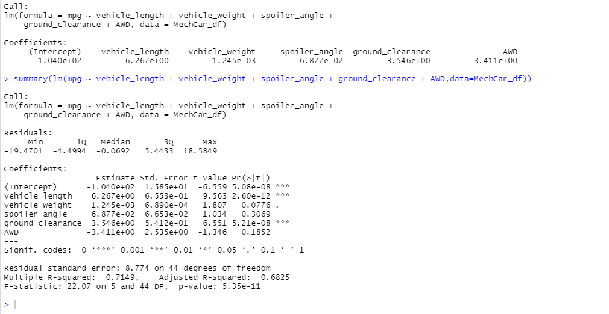
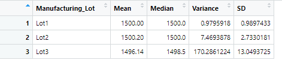
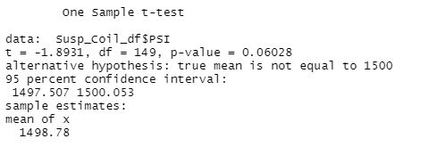
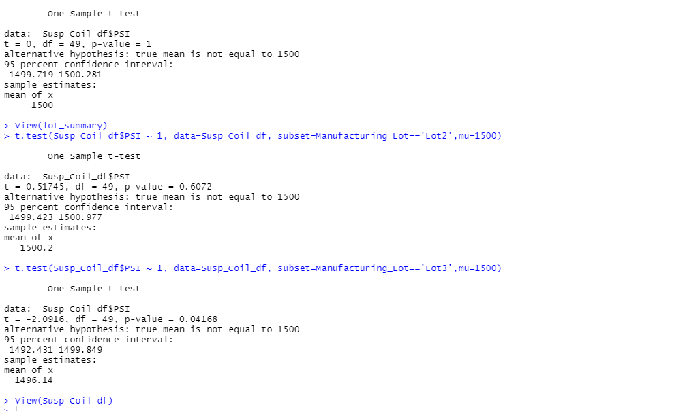

# MechaCar_Statistical_Analysis
## Summary
Utilizing R programming to perform statistical analysis on car perfornmance and related datasets.

## Linear Regression to Predict MPG

1.) Which variables/coefficients provided a non-random amount of variance to the mpg values in the dataset?

Answer: The intercept, vehicle_length, and ground_clearance provide the most non-random amount of variance to the mpg values in the dataset.

2.) Is the slope of the linear model considered to be zero? Why or why not?

Answer: No, the slope of the linear model is not considered to be zero because the p-value is significantly less than 1% which is less than a typical 5% alpha value.

3.) Does this linear model predict mpg of MechaCar prototypes effectively? Why or why not?

Answer: Yes, the model does predict MechaCar mpg effectively for the prototypes. This can be seen with the high adjusted R-sqared value of 0.6825, which produces a pearson correlation of 0.826. This number means that about 83% of the variation in the dependent variable can be explain by all the independent variables in the model. 

## Summary Statistics on Suspension Coils

1.) The design specifications for the MechaCar suspension coils dictate that the variance of the suspension coils must not exceed 100 pounds per square inch. Does the current manufacturing data meet this design specification for all manufacturing lots in total and each lot individually? Why or why not?

Answer: The overall variance for all three lots appears to meet the design specifications. However, when we break down the lots individually, only lots 1 and 2 meet the design specifications as their variances are below 100 pounds per square inch. Lot 3 fails to meet these specifications as its variance is 170 pounds per square inch. 

## T-Tests on Suspension Coils

1.) Briefly summarize your interpretation and findings for the t-test results. Include screenshots of the t-test to support your summary.

Answer: The t-test for all of the lots lead us not to reject the null hypothesis that the sample means were different from 1,500 PSI. The p-value was 0.06028 which is above the 5% threshold for most t-tests.

The t-tests for each lot are in the following order: 1st - Lot1, 2nd - Lot2, and 3rd - Lot3. For Lots 1 and 2, we fail to reject the null hypohesis that the sample means are different from 1,500 PSI. The p-value Lot1 is 1 while the p-value for Lo2 is 0.6072, which are both signifcantly greater than the 5% threshold. For Lot3, however, we did reject the null hypothesis that the sample means were equal to 1,500 PSI as the p-value was 0.04168 which is less than the 5% threshold. 

## Study Design: MechaCar vs Competition

1.) Write a short description of a statistical study that can quantify how the MechaCar performs against the competition. In your study design, think critically about what metrics would be of interest to a consumer: for a few examples, cost, city or highway fuel efficiency, horse power, maintenance cost, or safety rating.

2.) In your description, address the following questions:
 - What metric or metrics are you going to test?

- What is the null hypothesis or alternative hypothesis?

- What statistical test would you use to test the hypothesis? And why?

- What data is needed to run the statistical test?

Answer: There are three important metrics that I would want MechaCar to test for its vehicles and then compare with on of its competitors. I think Toyota would be a good competitor to compare MechaCar's cars against because the company is number in car sales in the U.S. and globally. 

The three metrics that I would put under consideration in this study would be the following:

- cost

- highway fuel efficiency

- safety rating

Since Toyota excels in all three of these categories and is the number one car seller in the world, it is reasonable to believe that these three caegories would be considerable drivers to MechaCar's success. 

The null hypothesis for all three categories would be the following:

- Since the burden of proof is on proving the alernaive hypothesis and we want MechCar's vehicles to be cheaper than Toyota's, we must perofrm our hypothesis tesing in the following manner: H0 (null hypothesis): The average price of MechaCar's vehicles exceeds or is equal to the average of $32,000 for similar vehicles from Toyota (from Car and Driver). Ha (althernative hypothesis): The average price of of MechaCar's vehicles are less than the average of $32,000 for similar vehicles from Toyota.

- For the hypothesis test for highway fuel economy, we would need to see if the average fuel economy for MechaCar's cars exceeds that of Toyota's. Therefore, H0 (the null hypothesis): The average fuel economy for MechaCar's vehciles is less or equal to than the average fuel economy of 29 mpg for Toyota' vehicles (from Car and Driver). Ha (alternative hypothesis): The average fuel economy for MechaCar's vechiles is greater than the average fuel economy of 29 mpg for Toyota vehicles. 

-Finally, for the hypothesis test for safety rating, we would want to determine if MechaCar's vehicles earned a higher safety rating than Toyota's. As a result, H0 (null hypotthesis): the average safety rating for MechaCar's vehicles is less than or equal to Toyota's of 4.0 (from Car and Driver). Ha (the alternative hypothesis): the average safety rating for MechaCar's vehicles is greater than Toyota's average safety rating of 4.0. 

For each metric, I would run a one-sample t-test because most of the data for Toyota is already published and so there would be no real need to gather random samples of different Toyota vehicles and compare them to that of MechaCar vehicles. The work is already done for us and it would just waste time. As a result, I would gather random samples of vehicles from MechaCars for each test and compare the results to the published statistics for Toyota. I would make sure that the sample sizes are large enough to draw inferences from (n>30) for the MechaCar's cars dataset. 

For the first hypothesis test, we compare the p-value to the lower-tail of the t-distribution, with a 5% alpha (what is normally used in studies). In the second testt, we compare the p-value to the upper-tail of the t-distribution also with a 5% alpha. Finally, for the third test, we also compare the p-value to the upper-tail of the t-distribution with a alpha of 5%. 

The data needed to run the costs and mpg statistical tests would be continuous numerical data since the numbers are measured and can end in decimal places. Safey Ratings is caetgorical ordrinal data as it represents a ranking, which does not need machine or measurements and can be grouped. 

